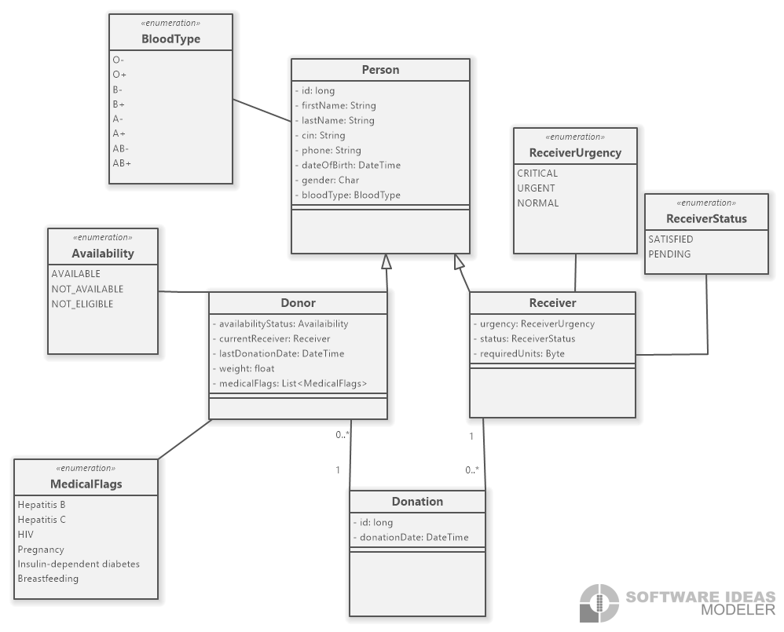
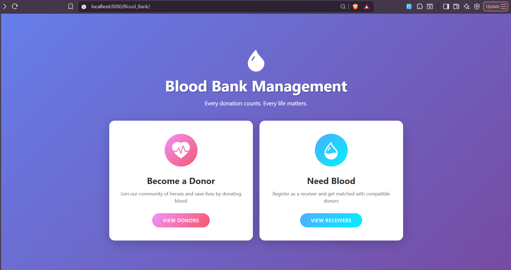
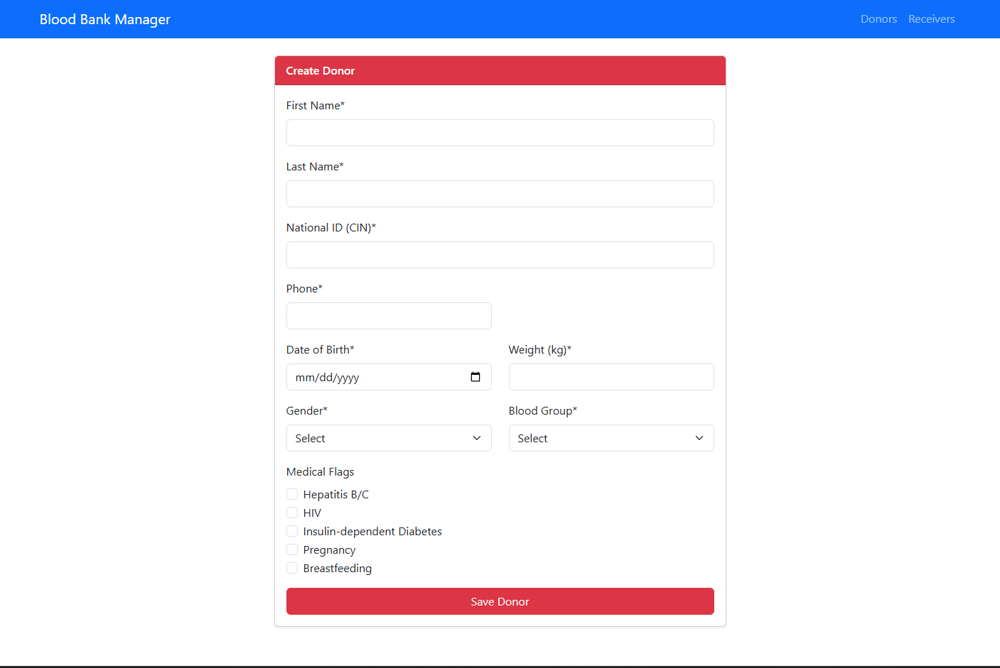
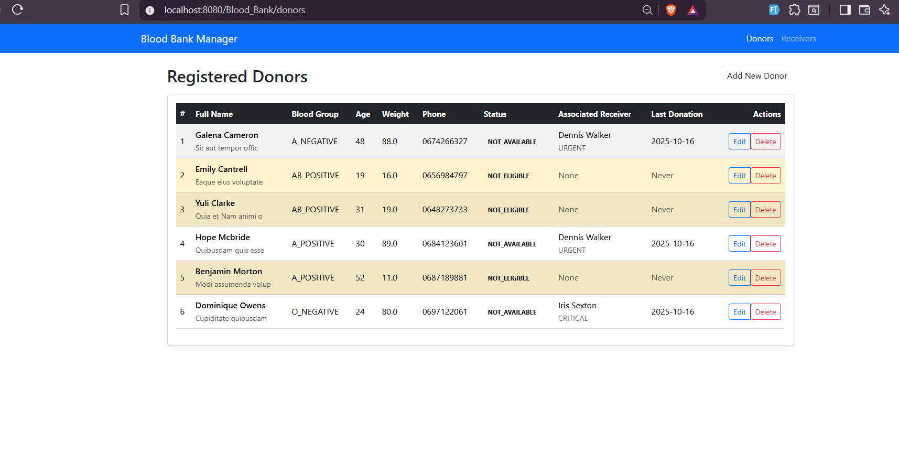
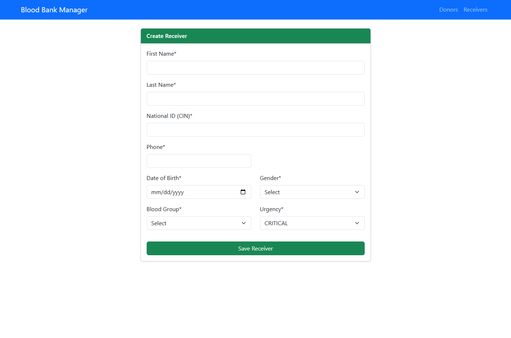
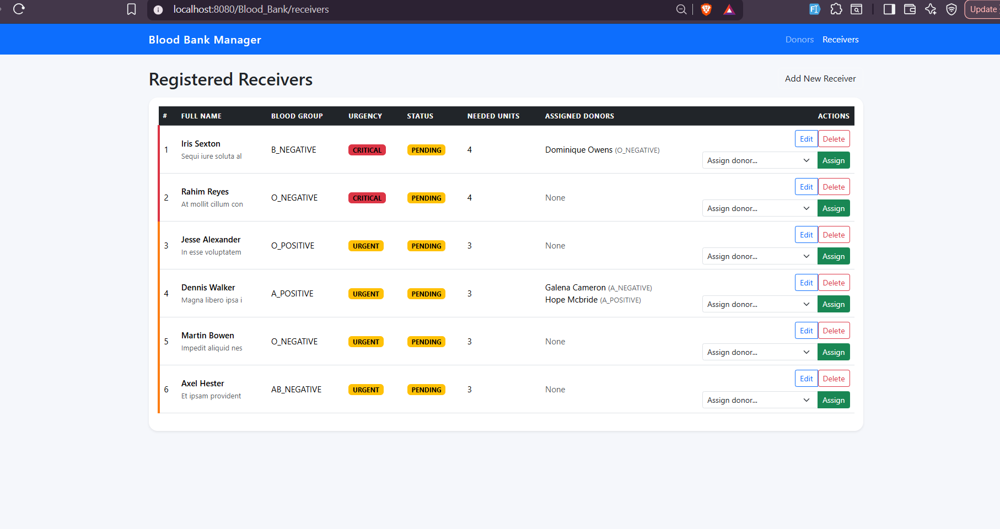

# Blood Bank Management System (BBMS)



## 📋 Overview

The Blood Bank Management System (BBMS) is a comprehensive web application designed to streamline blood donation and distribution operations. Built with Java EE technologies, this system efficiently manages donors, receivers, and blood donation assignments while ensuring blood type compatibility and tracking donation history.

## ✨ Features

- **Donor Management**: Register and track blood donors with detailed information including availability status and medical flags
- **Receiver Management**: Manage blood recipients with urgency levels and required blood units
- **Blood Compatibility System**: Automatically matches donors with receivers based on blood type compatibility
- **Assignment Tracking**: Monitor and record all blood donation assignments
- **Comprehensive Dashboard**: View and manage all donors and receivers from a centralized interface

## 🛠️ Tech Stack

- **Backend**: Java 17, Jakarta EE (Servlets, JSP, JSTL)
- **Persistence**: Hibernate ORM 5.4.30, JPA 2.1
- **Database**: MySQL 8.0
- **Build Tool**: Maven
- **Application Server**: Apache Tomcat 10
- **Logging**: SLF4J with Logback
- **Testing**: JUnit 5, Mockito

## 📸 Screenshots

### Home Page


### Create Donor


### Donors List


### Create Receiver


### Receivers List


## 🗂️ Project Structure

```
Blood_Bank/
├── src/
│   ├── main/
│   │   ├── java/org/blood_bank/
│   │   │   ├── controller/         # Servlet controllers
│   │   │   ├── entity/             # JPA entities (Donor, Receiver, Donation)
│   │   │   ├── repository/         # Data access layer
│   │   │   ├── service/            # Business logic layer
│   │   │   └── util/               # Utility classes
│   │   ├── resources/
│   │   │   ├── META-INF/
│   │   │   │   └── persistence.xml # JPA configuration
│   │   │   ├── database.properties # Database configuration
│   │   │   └── logback.xml         # Logging configuration
│   │   └── webapp/
│   │       ├── WEB-INF/
│   │       │   ├── views/          # JSP pages
│   │       │   └── web.xml         # Web app configuration
│   │       ├── static/             # CSS and static resources
│   │       └── index.jsp           # Landing page
│   └── test/                       # Unit tests
├── scripts/
│   └── schema.sql                  # Database schema
├── docs/                           # Documentation and screenshots
└── pom.xml                         # Maven configuration
```

## 🚀 Getting Started

### Prerequisites

- Java 17 or higher
- Maven 3.6+
- MySQL 8.0+
- Apache Tomcat 10.x

### Database Setup

1. Create the database and tables:
   ```sql
   mysql -u root -p < scripts/schema.sql
   ```

2. Configure database connection:
   ```bash
   cp src/main/resources/database.properties.example src/main/resources/database.properties
   ```

3. Edit `database.properties` with your MySQL credentials:
   ```properties
   db.url=jdbc:mysql://localhost:3306/bank_blood
   db.username=your_username
   db.password=your_password
   ```

### Build and Deploy

1. Clone the repository:
   ```bash
   git clone https://github.com/saadelquaul/Blood_Bank.git
   cd Blood_Bank
   ```

2. Build the project:
   ```bash
   mvn clean package
   ```

3. Deploy to Tomcat:
    - Copy `target/Blood_Bank.war` to your Tomcat `webapps` directory
    - Start Tomcat server
    - Access the application at `http://localhost:8080/Blood_Bank`

## 💾 Database Schema

The system uses three main tables:

- **donors**: Stores donor information including blood type, availability, and medical flags
- **receivers**: Manages recipient data with urgency levels and required blood units
- **donations**: Tracks the history of blood donations and assignments

## 🔧 Configuration

### Persistence Configuration
Edit `src/main/resources/META-INF/persistence.xml` for JPA settings.

### Logging Configuration
Modify `src/main/resources/logback.xml` to customize logging levels and output.

## 📝 Usage

1. **Register Donors**: Add new blood donors through the create donor page
2. **Register Receivers**: Add patients requiring blood transfusions
3. **View Listings**: Browse all donors and receivers with their status
4. **Assignment Management**: The system automatically handles blood type compatibility for assignments

## 🧪 Testing

Run unit tests with:
```bash
mvn test
```

- Saad El Quaul ([@saadelquaul](https://github.com/saadelquaul))
